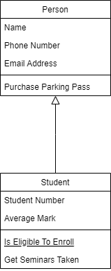

# Inheritance



Inheritance is a mechanism of creating a class based on another class, while retaining similar implementation. This is useful to make sure that class in the lower hierarchy get the features of the higher up class, but can also add specific features of their own. The class in lower hierarchy is usually called as "subclass" or "child class", while the class in the higher . In the example class diagram above, Student is a subclass of Person. Objects of Student class retains all states and behaviors that are defined in Person class while adding specific features of their own.

## Inheritance in Ruby

In ruby we use `<` symbol to define inheritance. Let's take a look at the following snippet:

```ruby
class Mammal
  def breathe  
    puts "inhale and exhale"  
  end  
end  
  
class Cat < Mammal  
  def speak  
    puts "Meow"  
  end  
end  
  
neko = Cat.new  
neko.breathe  
neko.speak  
```

Even though we didn't specify how an object of Cat class should breathe, every instance of Cat class will inherit that behaviour from the Mammal class since Cat class was defined as a subclass of Mammal. Hence from a programmer's standpoint, cats get the ability to breathe for free; after we add a speak method, our cats can both breathe and speak. In OO terminology, the smaller class is a subclass/child and the larger class is a super-class/parent.

### Overriding Inheritance

There will be situations where certain properties of the superclass should not be inherited by a particular subclass. For instance, although birds generally know how to fly, penguins are a flightless subclass of birds. In this example below, we override fly in Penguin class:

```ruby
class Bird 
  def preen
    puts "I am cleaning my feathers."
  end

  def fly
    puts "I am flying."
  end
end
  
class Penguin < Bird
  def fly
    puts "Sorry. I'd rather swim."
  end
end
  
p = Penguin.new
p.preen
p.fly
```

### Inherit `initialize`


[Image Source](https://id.pinterest.com/pin/140104238382538735/)

Take the following snippet:

```ruby
class Grandfather
  def initialize
    puts 'In Grandfather class'
  end
  
  def grandfather_method
    puts 'Grandfather method call'
  end
end

class Father < Grandfather
  def initialize
    puts 'In Father class'
  end
end

class Son < Father
  def initialize
    puts 'In Son class'
  end
end

# What's the output of each line?
son = Son.new
son.grandfather_method
father = Father.new
```

In the snippet above, Father class inherits from Grandfather class and overrides `initialize` method. In Ruby, the `initialize` method is just another method that is inherited all the way from BasicObject class which is the root of class hierarchy.

### `super` Inehrit

What if we want to have parent’s initialize behavior and extend its functionality at the same time? Take a close look at the following snippet:

```ruby
class Dog  
  def initialize(breed)  
    @breed = breed  
  end  
end  
  
class Lab < Dog  
  def initialize(breed, name)  
    super(breed)  
    @name = name  
  end  
  
  def to_s  
    "(#@breed, #@name)"  
  end  
end  
  
puts Lab.new("Labrador", "Benzy").to_s
```

When you invoke super with arguments, Ruby sends a message to the parent of the current object, asking it to invoke a method of the same name as the method invokes `super`. The `super` method sends exactly those arguments.

### Inehrit Variables

```ruby
class Dog  
  def initialize(breed)  
    @breed = breed  
  end  
end  
  
class Lab < Dog  
  def initialize(breed, name)  
    super(breed)  
    @name = name  
  end  
  
  def to_s  
    "(#@breed, #@name)"  
  end  
end  
  
puts Lab.new("Labrador", "Benzy").to_s
```

The `to_s` method in class Lab references `@breed` variable from the Dog superclass. This code works as you probably expect it to:

```ruby
puts Lab.new("Labrador", "Benzy").to_s # returns (Labrador, Benzy)`
```

Because that code behaves as expected, you may be tempted to say that these variables are inherited. That is not how Ruby works. The Lab class inherits initialize method from Dog and call it using super, `@breed` is created at the moment `super` is called.

## Summary

Rather than exhaustively define every characteristic of every new class, we need only to append or to redefine the differences between each subclass and its super-class. It is one of the benefits of object-oriented programming. Inheritance allows you to create a class that is a refinement or specialization of another class.

## Homework

For your homework, let's pick up where we left off with our Consolémon game. As of now, you must have at least the following classes:

```ruby
class Monster
  attr_reader :name, :attack_point
  
  def initialize(name, hitpoint, attack_point)
    @name = name
    @hitpoint = hitpoint
    @attack_point = attack_point
  end

  def to_s
    if @hitpoint > 0
      "#{@name}[#{@hitpoint}]"
    else
      "#{@name}[X]"
    end
  end

  def attack(monster)
    monster.take_damage(@attack_point)
    take_damage(0.5 * monster.attack_point)

    puts "#{@name} attacks enemy's #{monster.name}, deals #{@attack_point.to_f} damage and takes #{0.5 * monster.attack_point} damage"
  end

  def take_damage(amount)
    @hitpoint -= amount
  end
end

class Player
  attr_reader :monsters

  def initialize(name)
    @name = name
    @monsters = []
  end

  def add_monster(monster)
    monsters << monster.dup
  end

  def to_s
    result = "#{@name}:\n"
    
    @monsters.each_with_index do |monster, index|
      result += monster.to_s
      if index < @monsters.size - 1
        result += ', '
      else
        result += "\n"
      end
    end
    
    result
  end

  def play_turn(own_card, opponent_card, opponent)
    print "#{@name}'s "
    @monsters[own_card-1].attack(opponent.monsters[opponent_card-1])
  end
end
```

Now, in Consolémon, there are actually several kind of special monsters, they are called elemental monsters. Unlike regular monsters, when an elemental monster attacks a target, it will cause different kind of effects to the target. Following is two elemental monsters that we will implement in our homework:

1. Fire Monsters
    
    When a fire monster attacks a target opponent, it will not deal any initial damage to the target. Instead, the target will have 'burnt' status, taking damage in the amount of 40% attack point of the fire monster for three turns.
    
    As an illustration, if in Turn 1 a fire monster cppmander with 80 attack point uses its special attack against phpkachu, it will not deal any damage to phpkachu in that turn. But, in Turn 2, 3, and 4, phpkachu will take 32 damage (40% of cppmander's attack point).

2. Ice Monsters

    When an ice monster attacks a target opponent, it will deal damage in the amount of 20% of its attack point to its opponent. However, in addition to taking damage, the opponent will have 'frozen' status and can't attack any monster for one turn.
    
    As an illustration, if an ice monster bashtoise with 100 attack point uses its special attack against phpkachu, it will only deal 80 damage to opponent's phpkachu. But, opponent player can't command its phpkachu to attack for one turn.

Fill in the following skeleton and create the necessary classes to complete the program:

```ruby
# require_relative 'your_class_here', add other require_relative as necessary

phpkachu = Monster.new('Phpkachu', 120, 50)
sqlrtle = IceMonster.new('Sqlrtle', 180, 20)
cppmander = FireMonster.new('Cppmander', 100, 80)
bashtoise = IceMonster.new('Bashtoise', 120, 60)
torterraform = Monster.new('Torterraform', 200, 10)

player1 = Player.new('Player 1')
player1.add_monster(sqlrtle)
player1.add_monster(cppmander)
player1.add_monster(torterraform)

player2 = Player.new('Player 2')
player2.add_monster(phpkachu)
player2.add_monster(cppmander)
player2.add_monster(bashtoise)

puts '=======================Turn 1======================='
puts ''

puts player1
puts ''

puts player2
puts ''

player1.play_turn(2, 1, player2)
puts ''

puts player1
puts ''

puts player2
puts ''

player2.play_turn(2, 3, player1)
puts ''

puts player1
puts ''

puts player2
puts ''

puts '=======================Turn 2======================='
puts ''

# starting in turn 2, in the beginning of each turn, apply elemental effects to players' monsters here
# player1.your_new_method_here
# player2.your_new_method_here

puts player1
puts ''

puts player2
puts ''

player1.play_turn(1, 3, player2)
puts ''

puts player1
puts ''

puts player2
puts ""

player2.play_turn(3, 2, player1)
puts ''

puts player1
puts ''

puts player2
puts ''

puts '=======================Turn 3======================='
puts ''

# player1.your_new_method_here
# player2.your_new_method_here

puts player1
puts ''

puts player2
puts ''

puts '=======================Turn 4======================='
puts ''

# player1.your_new_method_here
# player2.your_new_method_here

puts player1
puts ''

puts player2
puts ''
```
